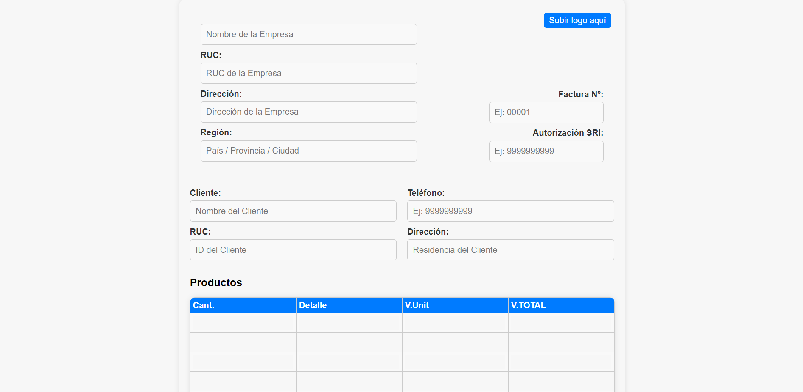

# Título del Proyecto: "Sistema de Facturación en HTML, CSS y JavaScript"

## Descripción del Proyecto

Este proyecto es una plantilla de factura desarrollada utilizando tecnologías web estándar, incluyendo HTML, CSS y JavaScript. La plantilla permite a los usuarios ingresar información de la empresa, información del cliente, y detalles de los productos, y calcula automáticamente los totales, incluyendo impuestos y descuentos, proporcionando una vista previa de la factura y la capacidad de descargarla como PDF.

## Características Principales

- Carga de logo de empresa.
- Cálculo automático de totales basado en cantidad y valor unitario.
- Campos para información detallada de la empresa y el cliente.
- Soporte para impuestos y descuentos personalizables.
- Vista previa de la factura antes de la descarga.
- Descarga de la factura en formato PDF.

## Demo

Puedes probar la aplicación en vivo aquí: [Facturer Demo](https://memory-game-nine-xi.vercel.app/)

## Capturas de Pantalla

## Instrucciones de Uso

1. Clona este repositorio o descárgalo como archivo ZIP.
2. Abre el archivo `index.html` en tu navegador web.
3. Completa los campos de información de la empresa, cliente y detalles de productos.
4. Observa cómo se calculan automáticamente los totales.
5. Haz clic en "Descargar Factura" para obtener la factura en formato PDF.

## Requisitos Técnicos

- Navegador web moderno que admita HTML5, CSS3 y JavaScript.

## Contribución

Si deseas contribuir a este proyecto, siéntete libre de abrir problemas (issues) o enviar solicitudes de extracción (pull requests) en GitHub. Tu ayuda es bienvenida.

## Licencia

Este proyecto está bajo la licencia MIT. Consulta el archivo [LICENSE](LICENSE) para más detalles.
